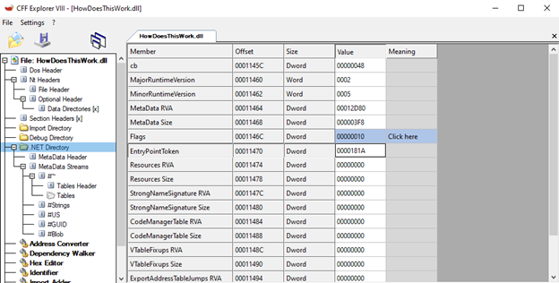

## Write-up flare-on 9
### Challenge 5-6
**1. Challenge 5: 05_t8** (Not solve)  
**2. Challenge 6: 06_alamode**
* Đề bài cho chúng ta một file `06_alamode.7z`, trong file này sẽ chứa hai file đề: `HowDoesThisWork.dll` và `IR chat log.txt`  
  
* Đầu tiên chúng ta sẽ xem đề bài cho chúng ta những gì ở bên trong file `chat log` kia.  
  
* Có vẻ như đây chỉ là một đoạn nói chuyện bình thường và sẽ chẳng có gợi ý gì cho chúng ta cả.  
* Sau khi check file `dll` thì đây là một file `.net x86`  
  
* Đây là lần đầu tiên mình gặp file `dll .net` nên khá bối rối và chưa biết nên làm như thế nào  
* Chúng ta sẽ xem bên trong file này có gì bằng `dnSpy x86`  
  
* Bên trong file này chỉ có một hàm `GetFlag`, hàm này sẽ lấy mật khẩu, sau đó tạo kết nối đến một pipeline có tên là `FlareOn` rồi ghi mật khẩu vào pipeline đó, đọc 64 bytes, chuyển hết chúng thành kí tự và trả ra chuỗi.  
* Có vẻ như file này không đơn giản là chỉ có hàm kia, vì chúng ta thấy nó tạo pipeline, rồi kết nối, có lẽ bên trong nó còn nhiều thứ hơn là một file đơn giản như thế này  
* Chúng ta sẽ thử `strings` linux để xem có tìm kiếm được chuỗi gì hay không?  
  
* Sau khi `strings` file `dll` này, bên trong nó có chứa khá nhiều `section` và `api` của windows  
* Chúng ta sẽ thử kiểm tra nó bằng ida xem sao, thay vì chọn mặc định `.net` thì chúng ta sẽ thử chọn sang định dạng `PE` file xem bên trong có thêm thông tin gì hay không?  
  
* Đầu vào file trỏ đến `DllEntryPoint`, nhưng khi check `CFF` thì chúng ta lại thấy một địa chỉ entry khác  
  
* Địa chỉ này trỏ đến một đoạn code không được định nghĩa, chúng ta sẽ tạo function bắt đầu từ địa chỉ này để xem tại sao nó bắt đầu từ đây  
  
* Có 2 hàm được gọi là `sub_1000188A` và `sub_100016E4`, sau khi xem qua hàm `sub_1000188A` thì có vẻ như không có gì. Chúng ta sẽ đến với hàm tiếp theo  
  
* Trong hàm này, có hàm `sub_10001163` chúng ta cần chú ý, hàm này sẽ gọi đến 2 hàm: `decrypt_xor0x17` và tạo một thread để thực thi hàm `sub_10001094`  
  
* Hàm `decrypt_xor0x17` sẽ lấy data có sẵn sau đó xor với `0x17` để tạo ra tên những `api` của windows  
  
* Chúng ta sẽ xem hàm còn lại `sub_10001094`, chúng ta sẽ thấy một pipeline tên `\\.\pipe\FlareOn`  
* Ngoài ra, chúng ta sẽ thấy nó gọi đến một hàm `encrypt_official`, và cũng là hàm chính chứa data để có thể giải ra được bài này  
  
* Trong hàm `encrypt_official` này chúng ta sẽ có được data gồm: `key` và `flag`. Hàm này sử dụng thuật toán, lấy data đã khởi tạo sau đó gen ra `key` và `flag`  
  
* Để lấy được `key` và `flag` chúng ta sẽ cần debug `dll` này để lấy 2 giá trị trên  
* Chúng ta sẽ load file này vào `x32dbg` rồi nhảy đến hàm `encrypt_official`  
  
* Chúng ta sẽ nhảy qua `algorithm2` để nhận 9 bytes `key`  
  
* Sau khi nhảy qua, chúng ta nhận được key = `MyV0ic3!`  
* Vì chúng ta không truyền vào gì nên khi nhảy xuống câu lệnh tiếp theo, chúng ta sẽ cần patch lệnh `je` để nó sẽ mặc định nhảy xuống đoạn gen flag  
  
* Sau khi patch, chúng ta sẽ nhảy qua hàm `algorithm2` và nhận `flag`  
  
* Vậy là chúng ta đã giải xong bài này và nhận được flag
* Đây là một challenge khá khó và cần biết cách sử dụng công cụ một cách linh hoạt cũng cần đọc hiểu code khá nhiều.
>***Flag: `M1x3d_M0dE_4_l1f3@flare-on.comm`***  

